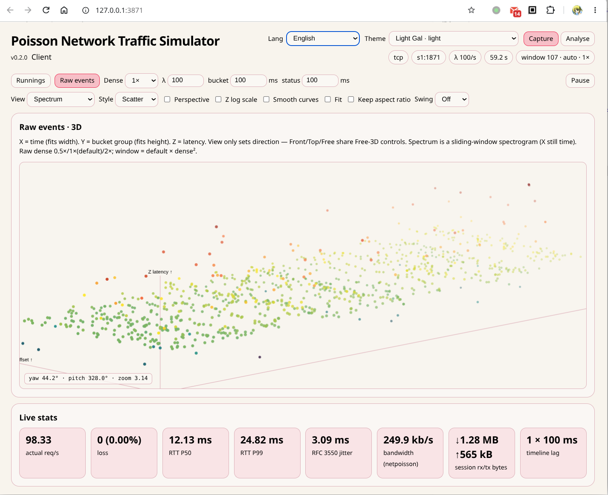
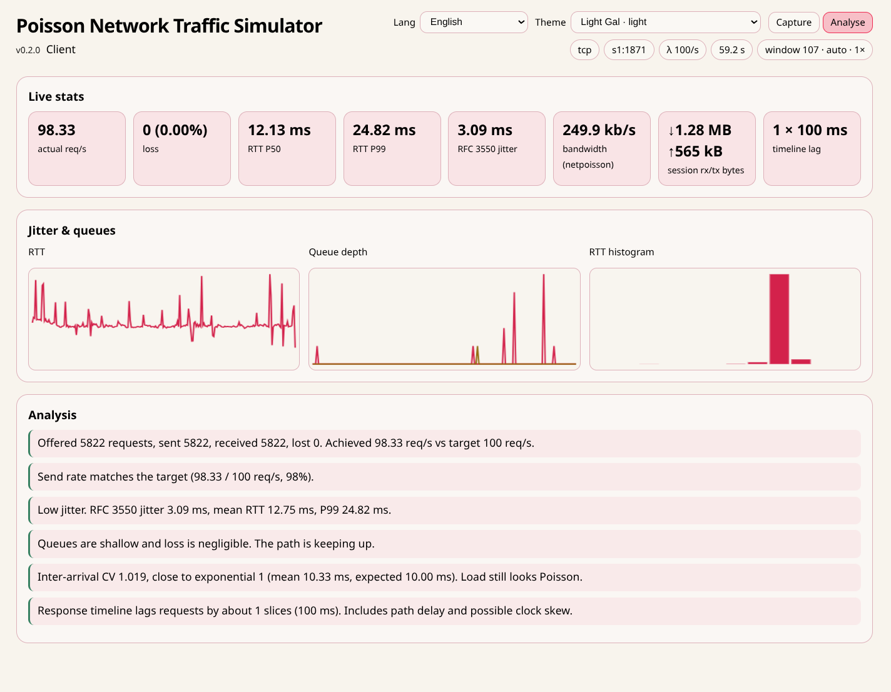

# netpoisson

`netpoisson` is a Poisson traffic tester for TCP, UDP, and SSH stdio. The
client offers requests on an absolute monotonic schedule; the server answers
ECHO and STATUS. Live Req/Resp timelines, a JSON report, and a web dashboard
show queues, RTT, loss, bandwidth, and schedule skew.

```bash
netpoisson [OPTION]... [SERVER]
```

With no `SERVER`, or with `-d`, it listens. Otherwise it connects to `SERVER`
(`host` or `host:port`). Use `--ssh` for an SSH stdio path.

## Protocol

### TCP / UDP (binary, version 2)

Each PDU is length-prefixed:

```text
uint32_be total_len     # bytes after this field
magic "NP" (2)
version = 2 (u8)
type: ECHO=1 STATUS=2 (u8)
flags (u8): REQ=0x01 RESP=0x02 TELEMETRY=0x04
reserved (u8)
seq (u64)
client_ns (u64)         # client monotonic send time
body_len (u32)
body...
```

- **ECHO request** body is the opaque payload.
- **ECHO response** without `TELEMETRY` is byte-identical to the request PDU.
- **ECHO response** with `TELEMETRY` keeps the same header fields and payload,
  then appends a fixed telemetry trailer (queues, byte counters, interval
  rates). Prefer this over frequent STATUS probes so observation does not
  invent extra load.
- **STATUS** body is a structured snapshot: totals, `read_pending` /
  `processing` / `response_pending`, `rx_bytes` / `tx_bytes`, optional kernel
  queue sizes, and a fixed newest-first window of recv/resp slice counts
  (default 120 × 100 ms).

UDP carries one PDU per datagram (including the length prefix).

### SSH stdio (NDJSON)

SSH mode does **not** use the binary PDU. Each message is one UTF-8 JSON line
prefixed with `@nPoi ` and terminated by `\n`:

```text
@nPoi {"v":1,"t":"hello","i":0,"cs":...}
@nPoi {"v":1,"t":"e","i":1,"cs":...,"d":"hello"}
@nPoi {"v":1,"t":"er","i":1,"cs":...,"sr":...,"ss":...,"d":"hello"}
@nPoi {"v":1,"t":"s","i":2,"cs":...}
@nPoi {"v":1,"t":"sr","i":2,...queues and timelines...}
```

Short field names (`v`,`t`,`i`,`cs`,`sr`,`ss`,`d`,`rq`,`sq`,…) keep overhead
low. Binary payloads use `"enc":"b64"`. Only lines starting with `@nPoi ` are
protocol; other stdout is `remote_noise`. SSH stderr is collected separately.
Every response is flushed immediately (no full buffering).

Clocks on the two hosts are different monotonic domains. Use RTT =
`client_receive - client_send` and `server_processing = ss - sr`; do not
subtract cross-host timestamps for one-way delay without a separate offset
estimate.

### Client validation

The client checks sequence correspondence, payload identity, duplicate
responses, reordering, UDP loss, RTT, and the skew of actual send time versus
the planned Poisson instant.

### Statistics output

When stdout is not a TTY (or with `--json`), live UI is suppressed and NDJSON
events / a final JSON report are written instead. `--report FILE` saves the
final report.

## Options

```text
Modes:
  SERVER missing             Run server
  SERVER present             Run client
  -d, --daemon               Explicit server mode
      --stdio-server         NDJSON @nPoi on stdin/stdout
      --ssh TARGET           Client over SSH stdio
      --install / --remove   systemd --user unit

Transport:
  -H, --host HOST            Bind host, default 0.0.0.0
  -p, --port PORT            Port, default 1871
  -u, --udp                  UDP; default TCP
      --tls                   TLS on TCP; PSK seal on UDP (--psk)
      --psk TEXT              UDP pre-shared key
      --ssh-command PATH
      --remote-command CMD
      --ssh-option KEY=VALUE

Traffic:
  -l, --lambda RATE          Mean requests/s, default 100
      --payload SIZE         Payload size, default 64B
      --connections N        Parallel TCP connections
      --max-pending N        Client queue limit
      --status-interval D    STATUS interval, default 100ms
      --bucket D             Timeline bucket, default 100ms
      --window D             Visible window, default 12s
      --seed N               Reproducible RNG
      --profile NAME         ssh-interactive | ssh-bulk

Execution:
  -s, --stats D              Run D and print final report
  -w, --web[=ADDR]           Start Web UI
      --no-open              Do not open browser
      --json                 NDJSON event output
      --report FILE          Save final JSON report
  -v / -q / -h / -V
```

## Timelines

Default bucket `100 ms`, window `12 s`. Compact TTY shows two lines; the web
UI shows four:

```text
Req.  client transmitted          pending <client_pending>
Recv. server received
Resp. server transmitted          processing / pending
Ack.  client received
```

`client_pending` grows when the Poisson scheduler keeps producing while the
socket writer is blocked.

## SSH stdio

```bash
# remote
netpoisson --stdio-server

# local (managed SSH child)
netpoisson --ssh user@server \
  --remote-command 'netpoisson --stdio-server' \
  -l 100 -s 60
```

Defaults include `ssh -T` and `-o BatchMode=yes -o Compression=no
-o ControlMaster=no -o ControlPath=none -o LogLevel=ERROR
-o ServerAliveInterval=0`.

Compare:

| Mode        | Measures                         |
| ----------- | -------------------------------- |
| Direct TCP  | Network baseline                 |
| SSH stdio   | Real SSH session/channel jitter  |
| SSH `-L`    | Forwarded TCP inside an SSH tunnel |

Profiles: `--profile ssh-interactive` (≈20 req/s, 1–128 B) and
`--profile ssh-bulk` (≈100 req/s, 4–64 KiB).

## TLS and UDP sealing

```bash
# TCP with TLS (server auto-generates a self-signed cert when --cert/--key omitted)
netpoisson -d --tls
netpoisson --tls --tls-insecure -l 100 -s 10 127.0.0.1

# UDP with PSK seal
netpoisson -d -u --tls --psk secret
netpoisson -u --tls --psk secret -l 100 -s 10 127.0.0.1
```

## Web dashboard

`-w` serves a live page with four timelines, RTT / jitter charts, analysis
notes, **netpoisson-induced bandwidth**, and **session rx/tx bytes**.

The header switches between **Capture** (live Runnings / Raw events) and
**Analyse** (stats, charts, and notes). Lang and Theme sit in the header;
defaults are English and **Dark X-Files** (`dark-x-files`), both persisted in
`localStorage`. Themes come from WorldMan (`suite/worldman/themes`), generated
into `src/web_themes/`. Dashboard copy (including analysis notes) lives in
`src/web_i18n/<locale>.json` and is not wired through gettext/`po/`.



*Capture* — Runnings / Raw events fill the viewport; Live stats stay pinned at
the bottom. Views: Front (X-Z), Top Down / Spectrum (X-Y with Z colormap);
optional perspective (default ortho), Z log scale, Fit + Keep aspect, and
Swing ±5–20°. Free 3D keeps LMB rotate / wheel zoom / MMB pan.



*Analyse* — actual req/s, loss, RTT percentiles, RFC 3550 jitter, bandwidth,
session bytes, timeline lag, plus RTT / queue / histogram charts and the
written analysis notes.

`--window` defaults to **auto** (fit the visible cells). Fixed durations such as
`--window 12s` disable auto resize. The dashboard can `POST /api/window` when
auto is on. **dense** (runnings 0.25×/0.5×(default)/1×/2×; raw 0.5×/1×(default)/2×) sets
`timeline window = default × dense` so X fits canvas width and Y (bucket group)
fits height. Live **λ**, **bucket**, and **status** interval post to
`/api/config`. Use **Pause/Resume** to freeze the live view (handy when Recv/Resp
briefly show gaps before STATUS redraws).

```bash
./scripts/regen-web-themes.sh
# or: SOPTOOLS_THEMES=/path/to/worldman/themes ./scripts/regen-web-themes.sh
```

## Examples

```bash
netpoisson -d
netpoisson -l 100 --payload 64 127.0.0.1
netpoisson -u -l 50 -s 10 127.0.0.1
netpoisson -w -l 100 127.0.0.1
netpoisson --ssh user@host --profile ssh-interactive -s 120
```

## Build and test

```bash
sudo apt install meson ninja-build python3 gettext asciidoctor
meson setup /build
ninja -C /build
meson test -C /build
```

Install puts a bash launcher in `bindir` (from `netpoisson.in`) and the Python
tree under `$prefix/lib/netpoisson/`.

## License

AGPL-3.0-or-later with the project anti-AI supplemental restriction. See
`LICENSE`.
